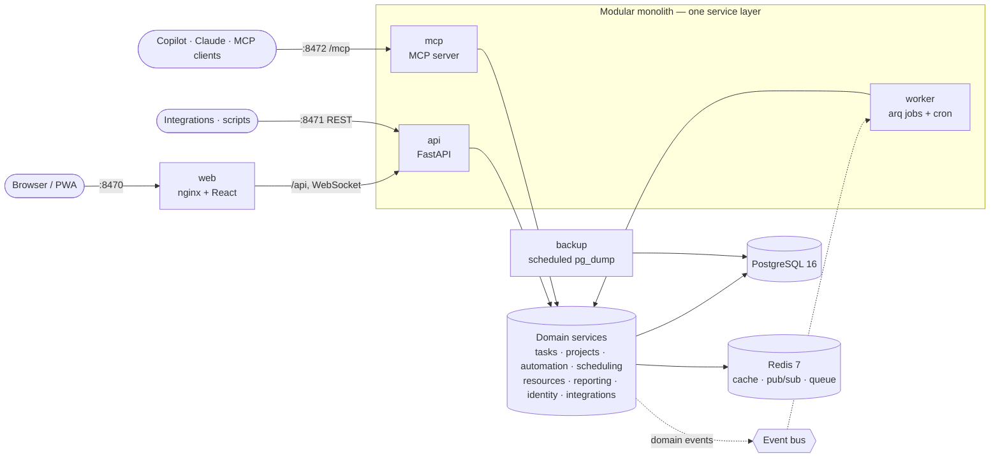

# Project Glasshaus

Self-hosted, web-based project management with first-class AI and MCP extensibility.
Every capability is delivered through one service layer and exposed identically via REST (OpenAPI 3.1),
webhooks and an MCP server.

> **Status:** v0.21.1. See [CHANGELOG.md](CHANGELOG.md) for what each release added and the [roadmap](#roadmap) for what is next.

## Contents

- [Overview](#overview)
- [Architecture](#architecture)
- [Quick start](#quick-start)
- [Configuration](#configuration)
- [Using the API](#using-the-api)
- [Automations and webhooks](#automations-and-webhooks)
- [Time, workload and reports](#time-workload-and-reports)
- [Administration, SSO and integrations](#administration-sso-and-integrations)
- [AI assistant](#ai-assistant)
- [Keyboard, accessibility and mobile](#keyboard-accessibility-and-mobile)
- [Onboarding](#onboarding)
- [MCP and Copilot setup](#mcp-and-copilot-setup)
- [Backup and restore](#backup-and-restore)
- [Upgrading](#upgrading)
- [Development](#development)
- [Roadmap](#roadmap)
- [Licence](#licence)

## Overview

| Area | Highlights (planned across phases) |
| --- | --- |
| Views | List, board, table, timeline/Gantt, calendar; saved views |
| Automation | No-code rules, recurring tasks, templates, execution log with retry |
| Scheduling | Dependencies with lag/lead, critical path, auto-rescheduling, baselines |
| Resources | Capacity, time tracking, utilization heatmap, forecasts |
| Portfolio | Cross-project rollups, RAG health, OKRs, executive dashboards |
| Collaboration | Comments, @mentions, activity feed, attachments, wiki |
| Reporting | Burndown, velocity, CFD, CSV/XLSX/PDF export, scheduled reports |
| Governance | Org/workspace/project hierarchy, RBAC, SSO, SCIM, audit log, retention |
| AI | MCP server for Copilot/Claude/any client; optional in-app AI (off by default) |

## Architecture



- **api**, **worker** and **mcp** run the same image with different commands, so the REST API, background
  jobs and MCP tools all call the same domain services.
- A one-shot **migrate** service applies Alembic migrations and baseline seed data before the app starts.
- Domain events feed automations, webhooks, notifications and the audit log (Phase 1+).
- Every tenant-owned row carries `tenant_id`; single-tenant by default.

More detail: [docs/architecture.md](docs/architecture.md).

## Quick start

Requirements: Docker Engine 24+ with the Compose v2 plugin, Bash, Git.

```bash
git clone https://github.com/parabyte-ca/project-glasshaus.git
cd project-glasshaus
./setup.sh            # add --demo for sample data, --pull to use published images
```

`setup.sh` is idempotent: it checks prerequisites, creates `.env` with generated secrets, builds images,
runs migrations and starts the stack, then waits for every service to report healthy.

| Service | Default URL |
| --- | --- |
| Web UI | http://localhost:8470 |
| API docs (OpenAPI 3.1) | http://localhost:8471/api/docs |
| MCP (Streamable HTTP) | http://localhost:8472/mcp |
| Metrics | http://localhost:8471/metrics |

Sign in as `GLASSHAUS_ADMIN_EMAIL` (default `admin@example.com`) with the `GLASSHAUS_ADMIN_PASSWORD` that
`setup.sh` generated in `.env` (`grep ^GLASSHAUS_ADMIN_PASSWORD= .env`), then change it under **Account**
(click your name in the header).

## Configuration

All configuration is via environment variables in `.env` (see [.env.example](.env.example)).
Secrets are generated by `setup.sh`; never commit `.env`.

| Variable | Default | Purpose |
| --- | --- | --- |
| `GLASSHAUS_VERSION` | from `VERSION` | Image tag to run |
| `GLASSHAUS_REGISTRY` | `ghcr.io/parabyte-ca` | Image registry |
| `GLASSHAUS_BIND_ADDRESS` | `0.0.0.0` | Host interface for the web and MCP ports (`127.0.0.1` behind a reverse proxy) |
| `GLASSHAUS_API_BIND_ADDRESS` | `127.0.0.1` | Host interface for the direct API port; API clients use the web port (`/api`) |
| `GLASSHAUS_UPSTREAM_PROXY` | `127.0.0.1/32` | Address or CIDR of a reverse proxy in front of the web container, so client addresses are real |
| `GLASSHAUS_TRUSTED_PROXIES` | `web,127.0.0.1,::1` | Proxies the API takes `X-Forwarded-For` from |
| `GLASSHAUS_WEB_PORT` | `8470` | Web UI host port |
| `GLASSHAUS_API_PORT` | `8471` | REST API host port |
| `GLASSHAUS_MCP_PORT` | `8472` | MCP server host port |
| `GLASSHAUS_PUBLIC_URL` | `http://localhost:8470` | External URL (links, CORS, OAuth redirects) |
| `GLASSHAUS_CORS_ORIGINS` | *(empty)* | Extra allowed origins, comma-separated |
| `GLASSHAUS_MCP_ALLOWED_HOSTS` | `localhost:*,127.0.0.1:*,mcp:*` | Host headers accepted by the MCP server |
| `GLASSHAUS_MCP_PUBLIC_URL` | `http://localhost:8472` | URL clients use for the MCP server (OAuth issuer; HTTPS or localhost enables OAuth) |
| `GLASSHAUS_MCP_RATE_LIMIT_PER_MINUTE` | `120` | MCP tool calls per user per minute (0 disables) |
| `GLASSHAUS_MCP_TOKEN` | *(empty)* | API token used by `glasshaus-mcp --transport stdio` |
| `GLASSHAUS_API_WORKERS` | `2` | API worker processes (each with its own database pool) |
| `GLASSHAUS_API_RATE_LIMIT_PER_MINUTE` | `1200` | REST/SCIM requests per token, session or address per minute (0 disables) |
| `GLASSHAUS_SECRET_KEY` | *generated* | Signs sessions and encrypts stored integration/SSO secrets (≥ 32 characters in production; changing it means re-entering those secrets) |
| `POSTGRES_PASSWORD` | *generated* | Database owner password (migrations, backups) |
| `POSTGRES_APP_PASSWORD` | *generated* | Password of `glasshaus_app`, the least-privilege role the app uses (RLS enforced) |
| `GLASSHAUS_ADMIN_EMAIL` | `admin@example.com` | First owner account, created when the organization has no users |
| `GLASSHAUS_ADMIN_PASSWORD` | *generated* | Initial password for that account |
| `GLASSHAUS_ADMIN_NAME` | `Administrator` | Display name for that account |
| `GLASSHAUS_DEFAULT_TENANT_NAME` | `My organization` | Name of the default organization |
| `REDIS_PASSWORD` | *generated* | Redis password |
| `GLASSHAUS_ENV` | `production` | `production`, `development` or `test` |
| `GLASSHAUS_LOG_LEVEL` | `INFO` | Log level |
| `GLASSHAUS_LOG_JSON` | `true` | JSON logs (set `false` for console output) |
| `GLASSHAUS_DEFAULT_TENANT_SLUG` | `default` | Tenant created on first run |
| `GLASSHAUS_MULTI_TENANT` | `false` | Enable multi-tenant mode |
| `GLASSHAUS_METRICS_ENABLED` | `true` | Expose Prometheus `/metrics` |
| `GLASSHAUS_OTEL_ENABLED` | `false` | Export OpenTelemetry traces (configure with standard `OTEL_*` variables) |
| `GLASSHAUS_AI_PROVIDER` | `none` | Optional AI assistant: `anthropic`, `openai` (Ollama, LM Studio…), `fake`; see [docs/ai.md](docs/ai.md) |
| `GLASSHAUS_AI_MODEL` | *(provider default)* | `claude-opus-5-5` for `anthropic`, `llama3.1` for `openai` |
| `GLASSHAUS_AI_API_KEY` | *(empty)* | Claude API key (or `ANTHROPIC_API_KEY`); optional bearer token for `openai` |
| `GLASSHAUS_AI_BASE_URL` | *(empty)* | `openai`: server URL, e.g. `http://ollama:11434/v1` or `https://<resource>.openai.azure.com/openai/v1` |
| `GLASSHAUS_AI_AUTH_HEADER` | `bearer` | `openai`: `api-key` for Azure OpenAI keys |
| `GLASSHAUS_AI_API_VERSION` | *(empty)* | `openai`: `api-version` for classic Azure deployment URLs |
| `GLASSHAUS_AI_EFFORT` | *(model default)* | Claude effort: `low`, `medium` or `high` |
| `GLASSHAUS_AI_FALLBACKS` | `true` | Claude: re-run a declined request on Anthropic's recommended fallback model |
| `GLASSHAUS_AI_TIMEOUT_SECONDS` | `120` | Provider request timeout |
| `GLASSHAUS_AI_RATE_LIMIT_PER_MINUTE` | `10` | AI requests per person per minute (0 disables) |
| `GLASSHAUS_BACKUP_DIR` | `./backups` | Host directory for database dumps |
| `GLASSHAUS_BACKUP_INTERVAL_HOURS` | `24` | Scheduled backup interval |
| `GLASSHAUS_BACKUP_RETENTION_DAYS` | `14` | Days to keep scheduled backups |

## Using the API

Interactive docs: `http://localhost:8471/api/docs`. The OpenAPI 3.1 contract is committed at
[docs/openapi.json](docs/openapi.json) and the web UI's typed client is generated from it (`make openapi`).

- **Authentication.** Create a personal API token (`POST /api/v1/tokens`, scopes `read`, `tasks:write`,
  `projects:write`, `admin`) and send `Authorization: Bearer ghp_…`. The browser uses HttpOnly session cookies
  with a double-submit CSRF token (`X-CSRF-Token`).
- **Authorization.** Organization roles (owner, admin, member, guest), workspace roles (admin, member,
  viewer) and project roles (admin, editor, commenter, viewer). A token can never exceed its user's role.
- **Tenancy.** Every row carries `tenant_id`; Postgres row-level security enforces isolation.
- **Errors** are RFC 9457 problem details (`application/problem+json`).
- **Concurrency.** Task responses carry an `ETag`; send `If-Match` (or `expected_version`) to avoid lost updates.
- **Destructive calls** (`DELETE /projects/{id}`, `POST /tasks/bulk-delete`) default to `dry_run=true` and
  return a preview of what would be removed.
- Tasks accept a UUID or a reference such as `WEB-12` wherever `{ref}` appears.
- **Custom fields** are defined per project; set values with `custom_fields: {"<field_id>": value}` (null clears),
  filter with `cf=<field_id>=<value>` and sort with `sort_field=<field_id>`.
- **Comments** are markdown; mention people with `@[Name](user:<id>)` or `@email`. Mentions, assignments and
  comments on your tasks create in-app notifications (`GET /api/v1/notifications`).
- **Activity** for a task or project: `GET /api/v1/activity?task=WEB-12`.
- **Saved views** store filters, grouping, sorting and columns; `GET /api/v1/views/{id}/tasks` runs one.
- **Live updates**: `WS /api/v1/ws` streams event identifiers for projects you can see.
- **Scheduling**: link tasks with `POST /api/v1/dependencies` (`fs`, `ss`, `ff`, `sf`, `lag_days`), read the
  critical path from `GET /api/v1/projects/{id}/schedule`, snapshot plans with baselines and check
  `…/schedule/warnings`. Turn on `auto_schedule` to push dependent tasks later automatically, or preview and apply
  fixes with `POST …/reschedule`.

```bash
TOKEN=ghp_...   # from POST /api/v1/tokens
curl -s -H "Authorization: Bearer $TOKEN" "http://localhost:8471/api/v1/tasks?q=WEB-12"
curl -s -H "Authorization: Bearer $TOKEN" -H 'content-type: application/json' \
  -d '{"project_id":"<uuid>","title":"Draft release notes","priority":"high"}' http://localhost:8471/api/v1/tasks
```

The full feature → REST → event → MCP mapping is in [docs/coverage-matrix.md](docs/coverage-matrix.md).

## Automations and webhooks

Project admins build rules under **Project settings → Automations**: *when* something happens (task created or
updated, status changed, comment added, due date approaching, or on a schedule), *only if* conditions match,
*then* run actions (set fields, assign, tag, create a subtask, comment, notify, call a webhook). Use **Dry run**
to check a rule against a task, and the run log to see what happened and retry failures. **Recurring tasks**
and **Template** live in the same settings page; pick a template under **Start from** when creating a project.

Webhooks POST JSON (`rule`, `project`, `task`, `event`, `sent_at`) and are signed with the rule's secret
(shown to project admins). Verify a delivery before trusting it:

```python
import hashlib, hmac, time

def verify(secret: str, header: str, body: bytes, tolerance: int = 300) -> bool:
    parts = dict(p.split("=", 1) for p in header.split(","))  # X-Glasshaus-Signature: t=…,v1=…
    expected = hmac.new(secret.encode(), f"{parts['t']}.".encode() + body, hashlib.sha256).hexdigest()
    return hmac.compare_digest(expected, parts["v1"]) and abs(time.time() - int(parts["t"])) < tolerance
```

Homelab targets on private addresses (Home Assistant, n8n, Node-RED, Tailscale `100.x`) need
`GLASSHAUS_WEBHOOK_ALLOW_PRIVATE=true` in `.env`; loopback, link-local and cloud metadata addresses are always
refused.

## Time, workload and reports

- **Log time** from any task (Duration accepts `45m`, `1h 30m`, `1.5h`, `1:30`) or start a timer; the
  running timer shows in the header with a Stop button.
- **Timesheets:** **Time → Timesheet** shows a person's week by task and day. Organization admins can
  pick anyone, so you can see which projects each person put time towards; **Time → Team report**
  totals hours per person and project for any range. Both export CSV (`/api/v1/time-entries/export`).
- **Workload:** planned remaining work against capacity per person and week. Admins set each person's
  hours per day right on that page (or `PATCH /api/v1/users/{id}` with `capacity_minutes`).
- **Reports:** every project has a **Report** (burn-up, throughput, status mix, lead time, estimate vs
  actual, CSV export of tasks). **Portfolios** roll project health up; **Goals** tracks OKRs with
  number-based or task-based key results and check-ins; **Dashboards** combine widgets and can be shared.
- **Custom reports:** build your own from tasks or time (group by up to two fields, up to six measures,
  filters, table / bar / line / single number), save and share them, export CSV, and put them on
  dashboards as tiles or target numbers with dashboard-wide filters. Everyone sees only data they can
  access. See [docs/reports.md](docs/reports.md). With the optional AI assistant, ask a question on the
  Reports page (or **Ctrl K** → *Ask reports*) and get an answer written from a report run with your access.

```bash
# Hours per person and project for September, as CSV
curl -s -H "Authorization: Bearer $TOKEN" \
  "http://localhost:8471/api/v1/time-entries/export?date_from=2026-09-01&date_to=2026-09-30" > september.csv
```

## Administration, SSO and integrations

Owners and admins use **Admin** in the sidebar:

- **People:** add people, change roles, deactivate or reactivate (sessions end at once), reset a password,
  sign someone out everywhere.
- **Single sign-on:** OIDC and SAML identity providers, just-in-time accounts, allowed domains, and an
  option to require SSO (owners keep password sign-in). See [docs/sso-scim.md](docs/sso-scim.md).
- **Provisioning:** SCIM 2.0 tokens for Entra ID, Okta, Authentik and others (`/scim/v2`).
- **Integrations:** Slack, Microsoft Teams, signed webhooks, GitHub/GitLab and email-to-task. Everyone can
  subscribe to their tasks from Google, Outlook or Apple calendars (**Account → Calendar feed**). See
  [docs/connectors.md](docs/connectors.md).
- **Audit log:** every change, sign-in, SSO, provisioning step and MCP tool call.
- **AI assistant:** turn the optional assistant on and choose its features (see below).
- **Data & retention:** how long to keep audit entries, activity, notifications and deleted tasks, and a
  full export of the organization's data.

The security baseline (OWASP ASVS L2) and the operator checklist are in [docs/security.md](docs/security.md).

## AI assistant

Optional and **off by default**. Set a provider on the server — Claude (`GLASSHAUS_AI_PROVIDER=anthropic`),
or Azure OpenAI or a local model through any OpenAI-compatible server such as Ollama (`openai`) — then an
admin turns it on in **Admin → AI assistant**. People then get:

- **Assistant** on each project: a written status update, task drafts from a short brief (added only when
  you choose), and risk flags with evidence and a next step.
- **Ask in plain words** in the command palette (Ctrl K / ⌘ K): "my overdue tasks in WEB" becomes task
  filters, run with your permissions. Only the question, project keys and names are sent.

- **Project assistant** (project **Digests** page): a daily stand-up digest for everyone on the project
  (overdue, due, stale and unassigned work, with an AI summary and focus list when allowed) and a weekly
  status draft for its admins, by notification, email or Slack/Teams. It also suggests follow-up
  comments, new due dates and owners, and turns meeting notes into tasks; nothing changes until a project
  editor or admin approves, except follow-ups an organization and project choose to let it post itself
  (daily limit, undo for 7 days). It runs as a *Project assistant (AI)* viewer account. See
  [docs/assistant.md](docs/assistant.md).

It only reads, sends the least data each feature needs, treats project text as untrusted, and records
every request in the audit log (without content). Details, privacy notes and an Ollama example:
[docs/ai.md](docs/ai.md). REST: `/api/v1/ai/*`; MCP: `ai_*` tools.

## My team (managers)

Managers see the people who report to them (from Entra ID or another identity provider over SCIM, or a
nightly Microsoft Graph sync): open, overdue and due work, time logged, projects and their health, and
recent activity, with each person's task list one click away (audited). By default managers see work
only in projects they can open (counts elsewhere); admins can widen it. See [docs/my-team.md](docs/my-team.md).

## Keyboard, accessibility and mobile

- **Ctrl K / ⌘ K** opens the command palette: jump to pages and projects, find tasks by key or title, ask
  the assistant. **?** lists every shortcut (`/` search, `c` new task, `g` then `h`/`m`/`d`/`r`/`t`/`w`/`p`/`o`/`a`
  to go to a section).
- Targets **WCAG 2.1 AA**; every screen is checked with axe in light and dark themes in CI. See
  [docs/accessibility.md](docs/accessibility.md).
- Installable as an app (PWA) on desktop and phones; the app shell opens offline. Only static files are
  cached by the service worker, never project data.
- **My tasks** (`/my`, **G** then **M**): your open tasks across projects by due date. It opens without a
  connection from a copy kept on the device, and tasks ticked offline are marked done when you are back.
- **Notifications on this device** (Account): Web Push to phones and desktops for mentions,
  assignments and alerts (HTTPS required; on iPhone, add to Home Screen first). See
  [docs/mobile.md](docs/mobile.md).
- Board cards move with **Alt+arrow keys** or their **Move** menu; filters and search live in the address,
  so a filtered view can be bookmarked or shared.
- Light and dark themes (black surfaces, blue actions, orange highlights, Inter). Colours are defined
  once in `frontend/src/index.css`.

## Onboarding

New people get a short **product tour** of the project page the first time they open a project, a
**getting-started checklist** docked bottom-right that ticks itself as they work, and **feature tips**
(pulsing dots) if they skip the tour. Restart the tour from **Product tour** in the footer or the
command palette. Everything is remembered per account. See [docs/onboarding.md](docs/onboarding.md).

## MCP and Copilot setup

The MCP server listens at `http://<host>:8472/mcp` (Streamable HTTP; `glasshaus-mcp --transport stdio`
for local use). It offers 67 tools (tasks, projects, dependencies, time, workload, reports, automations,
goals, status summaries, administration and the optional in-app assistant), read-only resources and four prompt templates, all over the same service layer
and permissions as the REST API. Assistants sign in with OAuth 2.1 (PKCE, dynamic client registration,
consent in the web app) when the server is reached over HTTPS or localhost, or with a personal API token
(**Account → API tokens**). Destructive tools preview unless `confirm=true`, and every call is audited.

Quick start for VS Code agent mode (`.vscode/mcp.json`, local stack):

```json
{
  "servers": {
    "glasshaus": { "type": "http", "url": "http://localhost:8472/mcp" }
  }
}
```

Tested configs for GitHub Copilot (VS Code), Copilot Studio, Microsoft 365 Copilot, Claude Desktop,
Claude Code and generic clients are in [docs/integrations](docs/integrations/README.md);
[examples/agent.py](examples/agent.py) is a scripted example.

## Backup and restore

- The `backup` service writes a `pg_dump` (custom format) to `GLASSHAUS_BACKUP_DIR` every
  `GLASSHAUS_BACKUP_INTERVAL_HOURS` and prunes files older than `GLASSHAUS_BACKUP_RETENTION_DAYS`.
- On demand: `make backup` (or `scripts/backup.sh [label]`).
- Restore: `make restore FILE=backups/glasshaus-….dump`. A safety backup is taken first, app services
  are stopped, the database is replaced, and the stack is restarted and health-checked.
- **Restore drill:** every `GLASSHAUS_BACKUP_DRILL_DAYS` (default 7; 0 turns it off) the backup service
  restores the newest backup into a scratch database, checks it (schema version, tables, people,
  projects, tasks), drops it and records the result. Run one now with
  `docker compose exec backup /bin/sh /scripts/restore-drill.sh [/backups/<file>.dump]`.
- **Admin → Backups** shows the newest backups and the last drill. Owners and admins get a notification
  (and an email, if email is set up) once a day while backups are late or a drill failed.
- Copy the backup directory off-host (for example with restic or rsync) for disaster recovery.

## Upgrading

```bash
./update.sh           # git pull + rebuild;  --pull uses published images;  --no-git skips git pull
```

`update.sh` backs up the database, fetches the new version and builds or pulls images. Then a
**pre-flight check** restores that backup into a scratch database, lets the new release migrate it and
starts the new API against it; only if the API becomes ready does the real upgrade go ahead. If the
pre-flight fails, nothing is changed and the running version keeps going (`--skip-preflight` skips it).
The upgrade then applies migrations, restarts and health-checks the stack; if any step fails it restores
the pre-update backup and restarts the previous version automatically.

Version-specific upgrade notes:

| Version | Notes |
| --- | --- |
| 0.21.1 | My team becomes private by default (managers see only projects they can open); existing organizations switch to it. Re-choose in Admin → Provisioning if wanted. `./update.sh` as usual. |
| 0.21.0 | Optional: for managers from Microsoft Graph, the worker needs outbound access to `login.microsoftonline.com` and `graph.microsoft.com` ([docs/my-team.md](docs/my-team.md)). `./update.sh` as usual. |
| 0.17.0 | Phone notifications need HTTPS and outbound access from the worker to the browsers' push services ([docs/mobile.md](docs/mobile.md)). `./update.sh` as usual. |
| 0.15.0 | The API and worker get a read-only view of the backup folder (Admin → Backups). On TrueNAS or other hosts with custom permissions, make sure uid 10001 can read `GLASSHAUS_BACKUP_DIR`. `./update.sh` as usual (its pre-flight check starts with the next upgrade). |
| 0.4.0 | New tables for dependencies and baselines; projects gain `auto_schedule` (off). `./update.sh` as usual. |
| 0.3.0 | New tables (custom fields, comments, notifications, saved views); existing events are backfilled with their project. `./update.sh` as usual. |
| 0.2.1 | Security patch for container base packages. `./update.sh` as usual. |
| 0.2.0 | One-time, because the 0.1.0 `update.sh` cannot hand over to its successor: run `git pull --ff-only && ./update.sh --no-git --rollback-rev ORIG_HEAD`. It generates `POSTGRES_APP_PASSWORD` and `GLASSHAUS_ADMIN_PASSWORD`, and `migrate` creates the `glasshaus_app` database role. From 0.2.0 on, `./update.sh` re-runs its own new version after pulling. |
| 0.1.0 | Initial release. |

## Development

```bash
make install       # uv sync, npm ci, pre-commit hooks
make dev-deps      # Postgres :15432 and Redis :16379 in Docker
make migrate       # apply migrations to the dev database
make dev-api       # API with reload on :8471
make dev-web       # Vite on :5173 (proxies /api to :8471)
make check         # lint + typecheck + tests (what CI runs)
make test-integration  # backend tests against Postgres/Redis
make test-e2e      # Playwright end-to-end + accessibility tests against the running stack
make help          # everything else
```

Releases: `make bump V=x.y.z`, add a `CHANGELOG.md` entry, commit, tag `vX.Y.Z` and push the tag — CI
builds, scans and publishes multi-arch (amd64/arm64) images to GHCR.

## Roadmap

| Phase | Version | Scope | Status |
| --- | --- | --- | --- |
| 0 | 0.1.0 | Scaffold, CI, Compose, README, seed data | ✅ |
| 1 | 0.2.0 | Data model, auth/RBAC, task/project CRUD, service layer, OpenAPI | ✅ |
| 2 | 0.3.0 | List/board/table views, custom fields, comments, activity | ✅ |
| 3 | 0.4.0 | Dependencies, timeline/Gantt, critical path, calendar | ✅ |
| 4 | 0.5.0 | Automation engine and templates | ✅ |
| 5 | 0.6.0 | Workload, time tracking (incl. per-user timesheets across projects), reporting, dashboards, portfolio/OKRs | ✅ |
| 6 | 0.7.0 | MCP server, OAuth 2.1, Copilot/Claude integration docs and tests | ✅ |
| 7 | 0.8.0 | Integrations, SSO/SCIM, audit, admin console (users, roles, deactivation), hardening, performance | ✅ |
| 8 | 0.9.0 | In-app AI layer, polish, accessibility, E2E tests | ✅ |
| 9 | 0.10.0–0.13.0 | Onboarding, usability and accessibility pass, refreshed theme, custom reports and dashboards, AI questions about reports | ✅ |
| 10 | 0.14.0 | Release automation, scheduled report emails | ✅ |
| 11 | 0.15.0 | Report alerts, backup restore drill and backup health, upgrade pre-flight check | ✅ |
| 12 | 0.16.0 | Slack and Teams: scheduled report and status posts; `/glasshaus` Slack command | ✅ |
| 13 | 0.17.0 | Phone: offline "My tasks", push notifications | ✅ |
| 14 | 0.18.0 | Project assistant (AI), phase 1: daily stand-up digest and weekly status draft (read-only) | ✅ |
| 15 | 0.19.0 | Project assistant, phase 2: approval queue for follow-ups, due dates, owners and tasks from notes | ✅ |
| 16 | 0.20.0 | Project assistant, phase 3: trusted follow-ups (organization limit, project choice, daily cap, undo) | ✅ |
| 17 | 0.21.0 | Reporting lines from Entra ID (SCIM and Microsoft Graph) and the "My team" page for managers | ✅ |

## Licence

[GNU Affero General Public License v3.0](LICENSE). If you run a modified version as a network service,
you must offer its source to its users.
